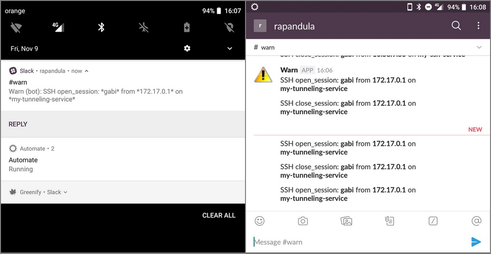
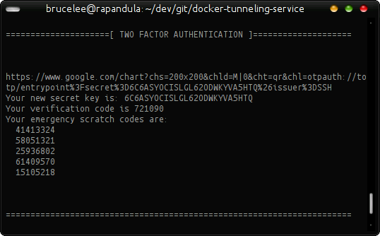

# Docker Tunneling Service

Docker image with a SSH service usable for tunneling only. It has Two-Factor Auth and it's sending an alert through Slack for every connect/disconnect event.



--------------------------------------------------------------------------------

### Purpose

This is meant to be used as a single entry point in a LAN network. Any other connections should be done through it.

This means that it should be the only SSH port forwarded through the LAN router.

Assuming someone gains access to this SSH server you'll be notified right away and be able to take quick action. Also, since it's a small docker image, your files won't be directly exposed to the attacker so he'll have a bit more work to do. That gives you time to intervene.

--------------------------------------------------------------------------------

### Security

 - An alert is sent to a Slack Incoming WebHook on connect/disconnect
 - Being a small docker image a hack won't directly expose your data
 - The SSH service doesn't provide a TTY
 - Any TTY attempt will automatically exit
 - The root password is randomly generated @ build time
 - The `su` binary is removed
 - The `username`, `password` & `slack endpoint` are entered manually @ build time

You could obviously change the image to use a key instead of a password. That would be better but it's not my use case.

--------------------------------------------------------------------------------

### Size

The built image has 7.72MB so it's pretty lightweight.

--------------------------------------------------------------------------------

### Config

In ```config.sh``` you'll be able to customize a few things. Just follow the comments.

If you wish you can hardcode the username, password and endpoint but I don't recommend it.

```shell
# The name of the docker image
PROJECT_NAME="docker-tunneling-service"

# The hostname of the created image
SSH_HOSTNAME="entrypoint"

# The port to which SSH will be mapped on the host machine
SSH_PORT=4321

# Require these only when buliding
if [ "$1" == "build" ]; then

    # The user you'll use to login
    read -p 'SSH Username: ' SSH_USERNAME
    # SSH_USERNAME="MY-USER"

    # The password you'll use to login
    read -p 'SSH Password: ' -s SSH_PASSWORD;echo
    # SSH_PASSWORD="MY-PASSWORD"

    # The Slack endpoint which will receive the alerts
    read -p 'Slack Endpoint: ' SLACK_ENDPOINT
    # SLACK_ENDPOINT="MY-SLACK-ENDPOINT"
fi
```

--------------------------------------------------------------------------------

### Build

This will require the username, password & slack endpoint and then it will build the docker image:

```shell
bash docker.sh build
```

During build-time the Two-Factor Authentication details will be shown so you'll have to scroll back to see them. It shoud look like this:



The authentication code will be provided by [Google Authenticator](https://play.google.com/store/apps/details?id=com.google.android.apps.authenticator2).

--------------------------------------------------------------------------------

### Launch

Launch the image:

```shell
bash docker.sh launch
```

--------------------------------------------------------------------------------

### Kill

Kill the currently running docker image:

```shell
bash docker.sh kill
```

--------------------------------------------------------------------------------

### Remove

Remove the already built docker image. It will ask for confirmation.

```shell
bash docker.sh remove
```

--------------------------------------------------------------------------------

### Customize Slack alert

If you want to customize the alert you can simply edit ```notifier.sh```.

Here's its current content:

```shell
curl -X POST --data-urlencode "payload={\"text\": \"SSH $PAM_TYPE: *$PAM_USER* from *$PAM_RHOST* on *`hostname`*\"}" "$SLACK_ENDPOINT"
```
